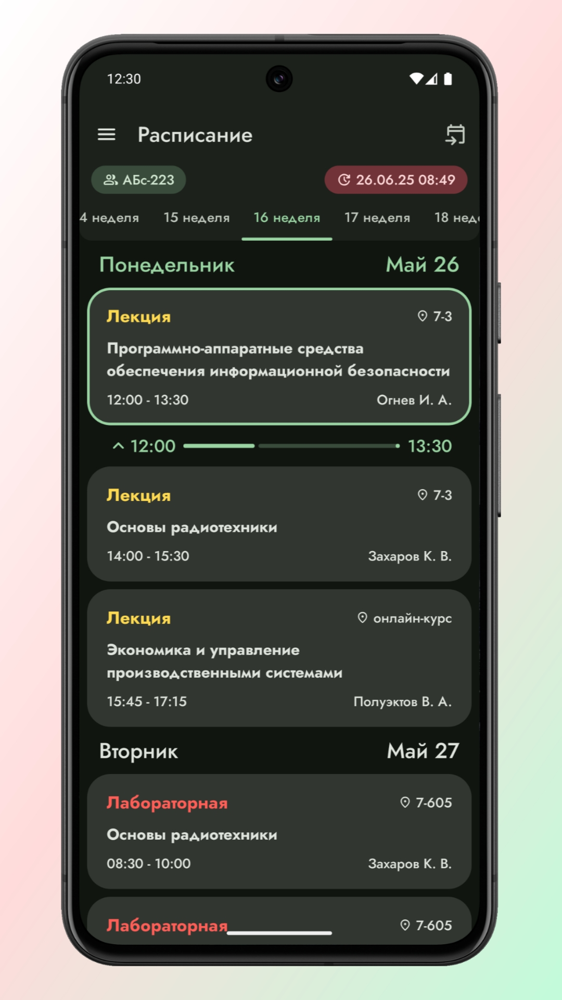
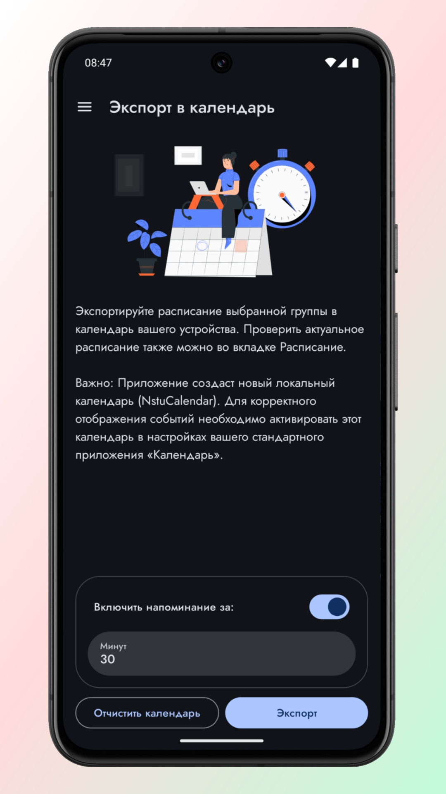
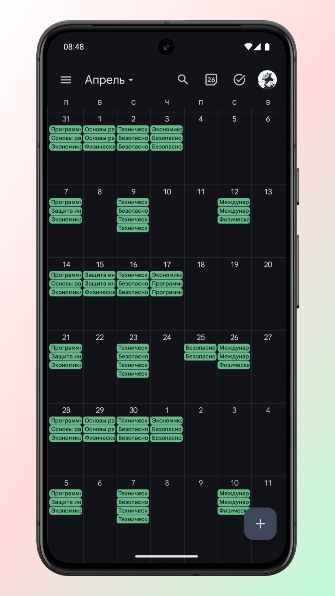
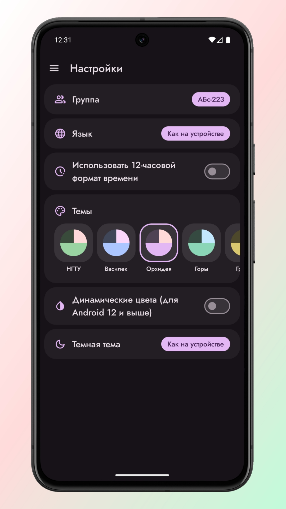

# NstuCalendar [RuStore](https://www.rustore.ru/catalog/app/com.lnoxdev.nstucalendarparcer)
Приложение для просмотра расписания студентов НГТУ НЕТИ
### Основное
Приложение создано для студентов НГТУ НЭТИ, чтобы сделать доступ к учебному расписанию максимально простым и быстрым. Оно дает возможность:  
- просматривать расписание своей группы;
- сохранять загруженные данные, обеспечивая доступ к расписанию в оффлайн-режиме;
- переносить расписание в календарь устройства.
### Скриншоты

  
  
  
  

